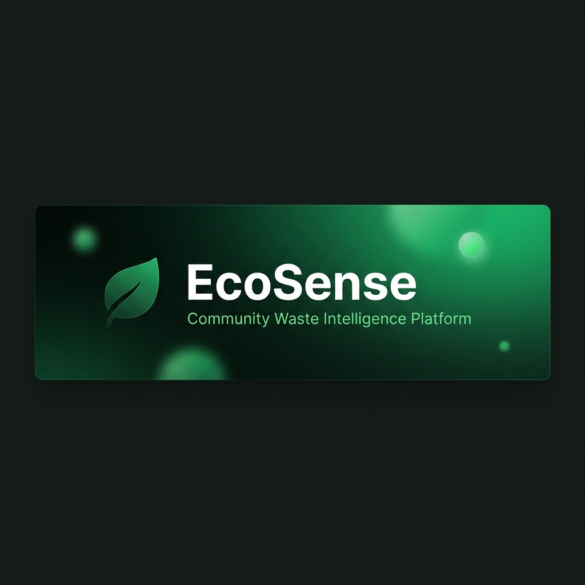
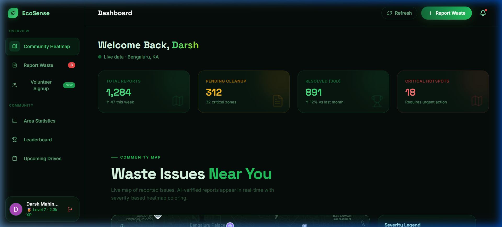

<p align="center">
  
</p>

<h1 align="center">🌿 EcoSense</h1>

<p align="center">
  <strong>Community Waste Intelligence Platform</strong><br/>
  AI-powered waste detection · Real-time heatmaps · Volunteer coordination · NGO command centre
</p>

<p align="center">
  
  
  
  
  
  
</p>

---

## 📸 Dashboard Preview

<p align="center">
  
</p>

---

## 🎯 What is EcoSense?

**EcoSense** is a full-stack community waste intelligence platform built for the **Hackmax 2.0** hackathon. It bridges the gap between citizens who spot waste and NGOs who clean it up — powered by AI vision, real-time maps, and gamified volunteering.

### The Problem

Urban waste management is broken. Illegal dumps go unreported, cleanup efforts are uncoordinated, and citizens have no way to track progress. Municipal authorities lack real-time data to prioritize action.

### Our Solution

EcoSense provides **two interconnected portals** — one for citizens and one for NGOs — creating a closed-loop waste management ecosystem:

1. **Citizens** photograph waste → AI verifies & classifies it → report appears on a live heatmap
2. **NGOs** see prioritized reports → assign volunteers → verify cleanup with before/after AI analysis
3. **Everyone** tracks community impact in real-time

---

## ✨ Key Features

### 🧑‍💻 Citizen Portal

| Feature | Description |
|---|---|
| **📸 AI Waste Detection** | Upload a photo and Llama 4 Scout (via Groq) classifies waste type, severity (1–10), and provides cleanup recommendations |
| **🗺️ Live Heatmap** | Google Maps integration with severity-coded circles showing waste hotspots in real-time from Firestore |
| **📝 Smart Reporting** | AI auto-fills waste type, severity, and description; captures GPS coordinates and reverse-geocodes to human-readable addresses |
| **🤝 Volunteer Signup** | Register with skills (Cleanup, Composting, Hazmat, E-Waste, Drone Mapping, etc.), preferred area, and weekly availability |
| **⏳ Anti-Spam Cooldown** | Server-enforced 4-day cooldown per user with fail-closed architecture — prevents abuse even with offline Firestore cache |
| **🏅 Gamification** | XP system, level progression, and leaderboard integration for engaged community members |

### 🏢 NGO Command Centre

| Feature | Description |
|---|---|
| **📊 Mission Dashboard** | Priority-ranked feed of citizen reports with severity scores, AI confidence levels, and waste thumbnails |
| **✅ AI-Verified Completion** | NGOs submit before/after photos; AI validates genuine cleanup before marking missions as resolved |
| **👥 Volunteer Management** | View registered volunteers, filter by skills/area, and assign them to cleanup missions |
| **📈 Impact Analytics** | Track total reports, resolution rates, critical hotspots, and volunteer engagement metrics |
| **📅 Drive Calendar** | Schedule and manage community cleanup drives |
| **🔔 Notifications** | Real-time alerts for new high-severity reports and mission updates |

---

## 🏗️ Tech Stack

```
Frontend        React 19.1 + Vite 6.3
Styling         Tailwind CSS v4.1 (Vite plugin)
Animations      Framer Motion
Icons           Lucide React
Auth            Firebase Authentication (Google OAuth + Email/Password)
Database        Cloud Firestore (real-time subscriptions)
AI Vision       Groq API → Meta Llama 4 Scout 17B (multimodal)
Maps            Google Maps JavaScript API + @react-google-maps/api
Fonts           Inter + Space Grotesk (Google Fonts)
```

---

## 🚀 Getting Started

### Prerequisites

- **Node.js** ≥ 18.x
- **npm** ≥ 9.x
- A [Firebase](https://console.firebase.google.com/) project with Authentication and Firestore enabled
- A [Groq API key](https://console.groq.com/) (free tier: 30 req/min)
- A [Google Maps API key](https://console.cloud.google.com/apis/credentials) with Maps JavaScript API enabled

### Installation

```bash
# Clone the repository
git clone https://github.com/scoredarsh/EcoSense.git
cd EcoSense

# Install dependencies
npm install
```

### Environment Setup

Create a `.env` file in the root directory:

```env
# Google Maps
VITE_GOOGLE_MAPS_API_KEY=your_google_maps_api_key

# Firebase
VITE_FIREBASE_API_KEY=your_firebase_api_key
VITE_FIREBASE_AUTH_DOMAIN=your_project.firebaseapp.com
VITE_FIREBASE_PROJECT_ID=your_project_id
VITE_FIREBASE_STORAGE_BUCKET=your_project.firebasestorage.app
VITE_FIREBASE_MESSAGING_SENDER_ID=your_sender_id
VITE_FIREBASE_APP_ID=your_app_id

# AI Vision (Groq)
VITE_GROQ_API_KEY=your_groq_api_key
```

### Run the Dev Server

```bash
npm run dev
```

The app will be available at `http://localhost:5173`.

---

## 📁 Project Structure

```
EcoSense/
├── index.html                  # Entry point
├── src/
│   ├── main.jsx                # React root
│   ├── App.jsx                 # Router & layout (citizen vs NGO)
│   ├── index.css               # Tailwind + custom design tokens
│   ├── firebase.js             # Firebase init (Auth + Firestore)
│   ├── components/
│   │   ├── Hero.jsx            # Landing page hero section
│   │   ├── Navbar.jsx          # Navigation bar
│   │   ├── Dashboard.jsx       # Citizen dashboard (sidebar + tabs)
│   │   ├── ReportSection.jsx   # AI-powered waste reporting form
│   │   ├── MapSection.jsx      # Google Maps heatmap with live data
│   │   ├── VolunteerSection.jsx# Volunteer registration & profile
│   │   ├── NGOLogin.jsx        # NGO email/password authentication
│   │   ├── NGODashboard.jsx    # NGO portal (iframe wrapper)
│   │   ├── FeedSection.jsx     # Community activity feed
│   │   ├── ShareSection.jsx    # Social sharing tools
│   │   ├── Toast.jsx           # Global toast notification system
│   │   └── Footer.jsx          # Site footer
│   ├── contexts/
│   │   └── AuthContext.jsx     # Firebase auth state management
│   └── services/
│       ├── groqService.js      # Groq Vision API (Llama 4 Scout)
│       ├── geminiService.js    # Gemini AI fallback service
│       └── reportStore.js      # Firestore CRUD + cooldown logic
├── ngo-dashboard.html          # Self-contained NGO command centre
├── docs/images/                # README assets
├── .env                        # Environment variables (git-ignored)
├── .gitignore
├── vite.config.js
└── package.json
```

---

## 🔐 Authentication Flow

EcoSense supports **two types of users**, automatically routed based on their email:

| User Type | Auth Method | Routing Rule |
|---|---|---|
| **Citizen** | Google OAuth (popup) | Default — any Google account |
| **NGO** | Email + Password | Email must end in `ngo`, `@ngo.in`, or `@ngo.com` |

```
Landing Page → [Login] → Is email pattern NGO? 
                            ├── Yes → NGO Command Centre
                            └── No  → Citizen Dashboard
```

---

## 🤖 AI Pipeline

The waste analysis pipeline uses **Groq's Llama 4 Scout 17B** multimodal model:

```
Image Upload → Canvas Compression (800×800 JPEG @ 80%) 
  → Groq Vision API → JSON Response
      ├── isGarbage: boolean
      ├── wasteType: General | Industrial | Hazardous | Recyclable | Water Body | Forest Area
      ├── severityScore: 1–10
      ├── description: string
      ├── recommendation: string
      └── confidence: 0.0–1.0
```

**Key safeguards:**
- 🔄 **Exponential backoff** — Retries up to 3× on rate-limit (429) errors with 3s → 6s → 12s delays
- 🚫 **AI gate** — Reports cannot be submitted unless AI confirms waste is present (`isGarbage: true`)
- 📦 **Image compression** — Reduces bandwidth with client-side canvas downscaling before API call

---

## 🗄️ Firestore Schema

### `waste_reports` Collection

```json
{
  "wasteType": "Industrial",
  "severity": "high",
  "severityScore": 8,
  "description": "Large pile of construction debris...",
  "aiVerified": true,
  "aiConfidence": 0.92,
  "aiRecommendation": "Contact municipal hazmat team...",
  "aiDescription": "Construction waste with exposed rebar...",
  "imageUrl": "data:image/jpeg;base64,...",
  "lat": 12.9716,
  "lng": 77.5946,
  "locationAddress": "Koramangala, Bengaluru, KA",
  "reporterName": "Darsh M.",
  "reporterEmail": "darsh@gmail.com",
  "reporterUid": "abc123...",
  "status": "pending | opted-in | resolved",
  "createdAt": "Timestamp"
}
```

### `volunteers` Collection

```json
{
  "name": "Darsh Mahindrakar",
  "email": "darsh@gmail.com",
  "phone": "+91 98765 43210",
  "area": "Koramangala",
  "skills": ["cleanup", "awareness", "data"],
  "availability": ["Sat", "Sun"],
  "status": "available",
  "xp": 0,
  "uid": "abc123...",
  "photoURL": "https://...",
  "registeredAt": "Timestamp"
}
```

---

## 🎨 Design Philosophy

EcoSense uses a **premium dark-mode glassmorphism** design system:

- **Color palette** — Deep forest greens (`#060d0a` → `#22c55e` → `#4ade80`) with severity-coded accents (amber, red, blue)
- **Typography** — Space Grotesk (display) + Inter (body) from Google Fonts
- **Glass surfaces** — `backdrop-filter: blur(20px)` with subtle green-tinted borders
- **Micro-animations** — Framer Motion for page transitions, hover states, and loading skeletons
- **Noise grain texture** — SVG fractal noise overlay for depth

---

## 📜 Scripts

| Command | Description |
|---|---|
| `npm run dev` | Start Vite dev server on `localhost:5173` |
| `npm run build` | Build optimized production bundle to `dist/` |
| `npm run preview` | Preview the production build locally |

---

## 👨‍💻 Team

Built with ❤️ for **Hackmax 2.0**

---

## 📄 License

This project is open-source and available under the [MIT License](LICENSE).